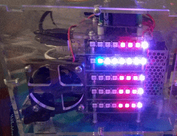

# CPU Temperature and Load shown with Pimoroni Blinkt!

https://shop.pimoroni.com/products/blinkt

# Usage
The following command runs the Cpu Info Docker container:
```bash
docker run -d \
    -name blinkt-cpu-info \
    --privleged \
    -e Mode=Mixed \
    cisecke/blinkt-cpu-info    
```

Privileged mode is needed to access the GPIO Header.

# Parameters
When running the client, the following parameters are available
* ```-e Mode=Mixed``` The Mode can be chosen between ```Mixed```(Default), ```Temp``` and ```Load```.
    * ```-e Mode=Temp``` shows the temperature in red, it is divided in 10°C steps. As example 4 red LEDs means 40°C
    * ```-e Mode=Load``` shows the CPU Load in blue, it is divided by 8(LED count) and represents 12.5%. As example 4 blue LEDs mean 50% CU Load.
    * ```-e Mode=Mixed``` combines the other 2 modes and mixes the colors as purple.



It's not easy to see in the image, but the white/bright color is purple.

# Future
* Make the docker image smaller. Currently it is around 180MB which is way to big for just a small functionality, but sadly Python and Respbian demand that space.
* Show Network use.

# More Info
* https://github.com/revsol/blinkt-cpu-info
* For issues ,suggestions or questions just create an Issue on Github.
* Thanks to [Pimoroni](https://shop.pimoroni.com/) for their great toys.